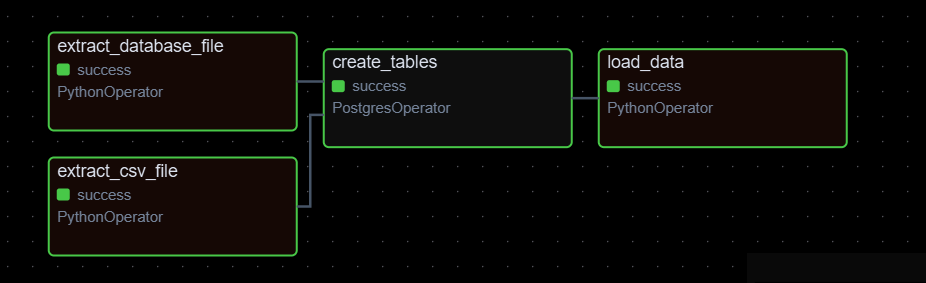

# Data Pipeline com Airflow e PostgreSQL

## Informações Gerais

Este projeto consiste na construção de um pipeline de dados orquestrado com **Apache Airflow**, que realiza a extração, transformação e carga (ETL) de dados de um banco **PostgreSQL** e de um arquivo **CSV** para um **Data Warehouse** em PostgreSQL local.

## Objetivo

Os dados de entrada consistem em:

* Um arquivo CSV localizado em `Airflow/data/` chamado **transacoes.csv**
* 6 tabelas em um banco PostgreSQL

A tarefa do pipeline é:

1. Extrair os dados tanto do CSV quanto das tabelas no PostgreSQL.
2. Salvar os arquivos extraídos em uma pasta organizada pela data da execução.
3. Criar 7 tabelas no banco `datawarehouse`:

   * As 6 tabelas do PostgreSQL
   * A tabela proveniente do CSV
4. Carregar os arquivos nas respectivas tabelas do `datawarehouse`.

## DAG



## Regras de Orquestração

* O pipeline é executado diariamente (D-1) às 04:35 da manhã.
* Todas as extrações são realizadas em paralelo.
* O processo de Load inicia somente após a conclusão de todas as extrações.

## Tecnologias Utilizadas

* Docker
* Apache Airflow
* PostgreSQL
* PgAdmin 4
* Pandas

---

## Execução

### Pré-requisitos

* Docker
* Docker Compose

### Passo a passo

1. **Clonar o repositório**

   ```bash
   git clone https://github.com/gabrielpedrosati/data-pipeline-airflow-postgres.git
   cd data-pipeline-airflow-postgres
   ```

2. **Criar as pastas necessárias**

   ```bash
   mkdir logs datalake
   ```

3. **Subir os containers**

   ```bash
   docker compose up -d
   ```

4. **Acessar o Airflow no navegador**

   ```
   http://localhost:8080
   ```

   Credenciais padrão:

   * Usuário: airflow
   * Senha: airflow

5. **Executar a DAG**

   * No painel do Airflow, habilite e execute a DAG chamada **etl_pipeline**.

---

## Fluxo ETL

Extract → Extração dos dados (CSV + tabelas PostgreSQL)
Transform → Organização e padronização dos dados extraídos
Load → Inserção nas tabelas do Data Warehouse

---

## Agendamento

O agendamento da DAG utiliza a seguinte expressão cron:

```text
35 4 * * *
```

Ou seja, é executada todos os dias às 04:35 AM.
# Data Pipeline com Airflow e PostgreSQL

## Informações Gerais

Este projeto consiste na construção de um pipeline de dados orquestrado com **Apache Airflow**, que realiza a extração, transformação e carga (ETL) de dados de um banco **PostgreSQL** e de um arquivo **CSV** para um **Data Warehouse** em PostgreSQL local.

## Objetivo

Os dados de entrada consistem em:

* Um arquivo CSV localizado em `data/` chamado **transacoes.csv**
* 6 tabelas em um banco PostgreSQL

A tarefa do pipeline é:

1. Extrair os dados tanto do CSV quanto das tabelas no PostgreSQL.
2. Salvar os arquivos extraídos em uma pasta organizada pela data da execução.
3. Criar 7 tabelas no banco `datawarehouse`:

   * As 6 tabelas do PostgreSQL
   * A tabela proveniente do CSV
4. Carregar os arquivos nas respectivas tabelas do `datawarehouse`.

## DAG


## Regras de Orquestração

* O pipeline é executado diariamente (D-1) às 04:35 da manhã.
* Todas as extrações são realizadas em paralelo.
* O processo de Load inicia somente após a conclusão de todas as extrações.

## Tecnologias Utilizadas

* Docker
* Apache Airflow
* PostgreSQL
* PgAdmin 4
* Pandas

---

## Execução

### Pré-requisitos

* Docker
* Docker Compose

### Passo a passo

1. **Clonar o repositório**

   ```bash
   git clone https://github.com/gabrielpedrosati/data-pipeline-airflow-postgres.git
   cd data-pipeline-airflow-postgres
   ```

2. **Criar as pastas necessárias**

   ```bash
   mkdir logs datalake
   ```

3. **Subir os containers**

   ```bash
   docker compose up -d
   ```

4. **Acessar o Airflow no navegador**

   ```
   http://localhost:8080
   ```

   Credenciais padrão:

   * Usuário: airflow
   * Senha: airflow

5. **Executar a DAG**

   * No painel do Airflow, habilite e execute a DAG chamada **etl_pipeline**.

---

## Fluxo ETL

Extract → Extração dos dados (CSV + tabelas PostgreSQL)
Transform → Organização e padronização dos dados extraídos
Load → Inserção nas tabelas do Data Warehouse

---

## Agendamento

O agendamento da DAG utiliza a seguinte expressão cron:

```text
35 4 * * *
```

Ou seja, é executada todos os dias às 04:35 AM.
